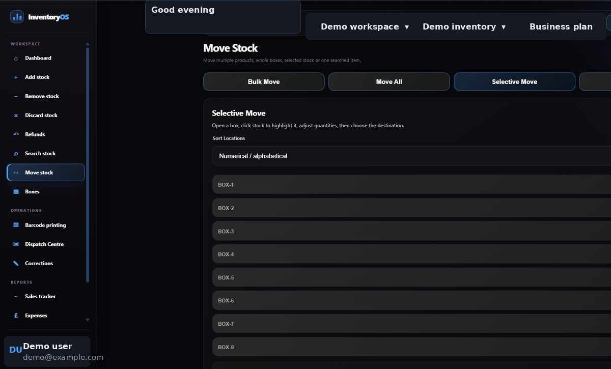
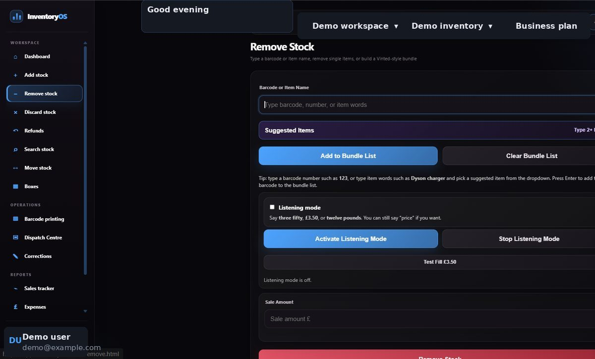
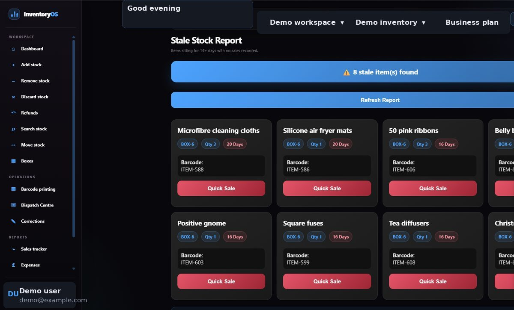

# Move, remove and check stock

## Move stock to another location

1. Open **Move Stock**.
2. Choose **Single Item** for one product, or a bulk mode when moving several.
3. Find the item by name or barcode, set the quantity, choose the destination, and review the move before confirming.
4. Check **Search Stock** to see the updated location totals.

<figure><figcaption></figcaption></figure>

## Remove sold stock

1. Open **Remove Stock** and search for each item to add to the bundle.
2. Enter the quantity required for each item. Check the proposed locations before confirming so you know where to pick from.
3. Confirm the removal. InventoryOS then updates the saved quantities.

If there is not enough stock in a location, reduce the requested quantity or correct the saved stock before trying again. For broken, lost or donated stock, use **Discard Stock** instead of treating it as sold.

<figure><figcaption></figcaption></figure>

## Check slow-moving products

Open **Stale Stock** and refresh the report to review items that have sat for a while. Use the result as a prompt to inspect the actual location and listing before making changes.

<figure><figcaption></figcaption></figure>
