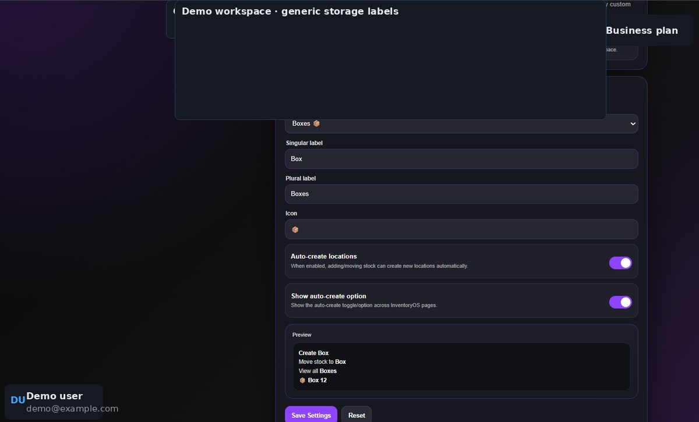

# Pro: advanced workflows

Pro includes Starter, removes the active-stock item limit, and adds multiple inventories, Gmail shipping-label import, direct QZ Tray printing, custom workspace location wording, and reorder rules.

## Keep inventories separate

Use the **inventory selector** in the top bar when you have more than one inventory. Check the selected inventory before adding, moving, removing, or assigning stock. The **workspace selector** switches the surrounding account or team workspace.

## Change location wording

Open **Settings → Open Workspace Settings → Location Wording**. Choose the preferred singular and plural names, then **Save Settings**. Numeric locations can display with the chosen word; an explicitly saved name such as “Box 1” keeps its saved wording.

<figure><figcaption></figcaption></figure>

## Connect Gmail for shipping labels

In **Dispatch Centre → Email Label Import**, connect the Gmail account, scan relevant messages, review the selected attachments, then import the shipping labels to the packing queue. This connection is optional; the manual PDF upload remains available.

## Print directly from the PC

QZ Tray direct printing requires the local printing setup on the PC and the correct 2×1 or 4×6 printer. Use **Settings** or **Printer Setup** to follow that setup; check one test label before a batch. For a phone, use the page's mobile share action instead.

## Set reorder rules

See [Reordering and email reminders](reordering.md).
