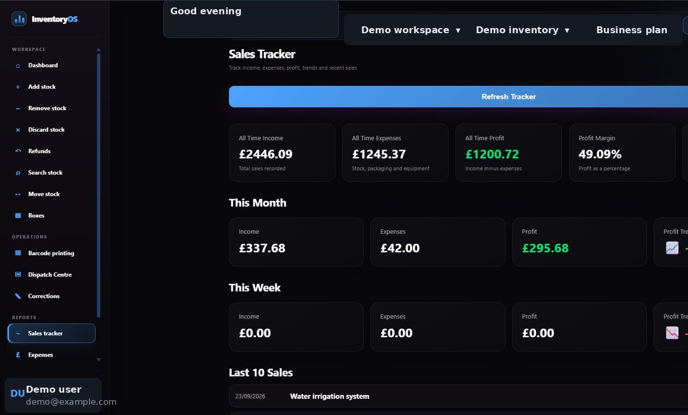

# Starter: selling and dispatch

Starter includes the Free workflow, increases the active stock limit to **1,000**, and adds full sales history, refunds, corrections, expenses and receipt uploads, barcode labels and print jobs, and shipping-label upload with Dispatch Centre.

## Review performance and record costs

Open **Sales Tracker** to compare this month, this week, recent sales, and the monthly breakdown. Open **Expenses** to add a cost and upload a receipt where relevant. Keep the costs and sales associated with the right inventory.

<figure><figcaption></figcaption></figure>

<figure><figcaption></figcaption></figure>

## Correct a mistake

Open **Corrections** to adjust a saved item or sale when the recorded details are wrong. Check the selected product, location, and quantity before saving. Use **Refunds** when reversing a sale rather than adding stock manually without a record.

<figure><figcaption></figcaption></figure>

Next: [Barcode labels and print jobs](printing.md), then [Packing and shipping labels](dispatch.md).

